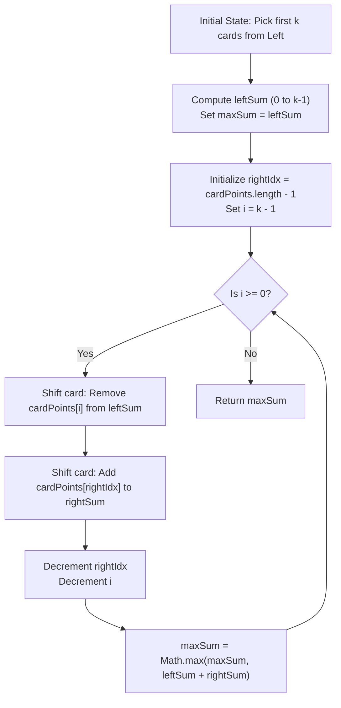

<h2><a href="https://leetcode.com/problems/maximum-points-you-can-obtain-from-cards">1423. Maximum Points You Can Obtain from Cards</a></h2>

<p>There are several cards <strong>arranged in a row</strong>, and each card has an associated number of points. The points are given in the integer array <code>cardPoints</code>.</p>

<p>In one step, you can take one card from the beginning or from the end of the row. You have to take exactly <code>k</code> cards.</p>

<p>Your score is the sum of the points of the cards you have taken.</p>

<p>Given the integer array <code>cardPoints</code> and the integer <code>k</code>, return the <em>maximum score</em> you can obtain.</p>

<p>&nbsp;</p>
<p><strong class="example">Example 1:</strong></p>

<pre><strong>Input:</strong> cardPoints = [1,2,3,4,5,6,1], k = 3
<strong>Output:</strong> 12
<strong>Explanation:</strong> After the first step, your score will always be 1. However, choosing the rightmost card first will maximize your total score. The optimal strategy is to take the three cards on the right, giving a final score of 1 + 6 + 5 = 12.
</pre>

<p><strong class="example">Example 2:</strong></p>

<pre><strong>Input:</strong> cardPoints = [2,2,2], k = 2
<strong>Output:</strong> 4
<strong>Explanation:</strong> Regardless of which two cards you take, your score will always be 4.
</pre>

<p><strong class="example">Example 3:</strong></p>

<pre><strong>Input:</strong> cardPoints = [9,7,7,9,7,7,9], k = 7
<strong>Output:</strong> 55
<strong>Explanation:</strong> You have to take all the cards. Your score is the sum of points of all cards.
</pre>

<p>&nbsp;</p>
<p><strong>Constraints:</strong></p>

<ul>
	<li><code>1 &lt;= cardPoints.length &lt;= 10<sup>5</sup></code></li>
	<li><code>1 &lt;= cardPoints[i] &lt;= 10<sup>4</sup></code></li>
	<li><code>1 &lt;= k &lt;= cardPoints.length</code></li>
</ul>


---

# 🛍️ Maximum-Points-You-Can-Obtain-from-Cards | Explained

## Approach 1: Sliding Window via Prefix-to-Suffix Transfer
### Intuition
When taking $k$ cards from either the start or the end of the array, any valid selection consists of taking $x$ cards from the beginning (prefix) and $k - x$ cards from the end (suffix), where $0 \le x \le k$.

Instead of generating all possible combinations from scratch, we start with an extreme scenario: take all $k$ cards from the front of the array. We calculate this initial total score. Then, we iteratively "put back" one card from the left side (reducing the prefix) and "pick up" one card from the right side (expanding the suffix). At each transition, we compute the combined sum of the remaining left cards and the newly added right cards, updating our maximum score tracking variable whenever a higher score is found.

Think of it like choosing $k$ dishes from a long buffet line where you can only take items from the far-left or far-right ends. You fill your tray with $k$ items strictly from the left. Then, you decide to trade the last left dish on your tray for the first right dish. Next, you trade the second-to-last left dish for the second right dish, and so on. Throughout these swaps, you remember which tray combination gave you the maximum total points.

### Algorithm Visualized


### Approach
1. **Initialize Accumulators**: Declare variables `maxSum`, `leftSum`, and `rightSum` to keep track of the peak score, the current sum of cards selected from the left end, and the current sum of cards selected from the right end.
2. **Compute Initial Prefix Sum**: Iterate through the first $k$ elements (`0` to `k - 1`) of `cardPoints`, summing them into `leftSum`. Set `maxSum` to this value, representing the scenario where all $k$ cards are taken from the left.
3. **Iteratively Swap Left Cards for Right Cards**:
   - Set a pointer `rightIdx` pointing to the last element of the array (`cardPoints.length - 1`).
   - Loop backwards from $i = k - 1$ down to $0$:
     - Subtract `cardPoints[i]` from `leftSum` (removing the rightmost remaining card from the left selection).
     - Add `cardPoints[rightIdx]` to `rightSum` (adding the next card from the right end).
     - Decrement `rightIdx` to move the right selection boundary inward.
     - Compare the new total (`leftSum + rightSum`) against `maxSum` and update `maxSum` if the new total is greater.
4. **Return Maximum**: Return `maxSum` after evaluating all $k + 1$ possible combinations.

### Detailed Code Analysis

Here is the exact code breakdown mapping logic directly to implementation steps:

- **Lines 7–9**: `let maxSum = 0; let leftSum = 0; let rightSum = 0;`  
  Initializes scalar variables used to maintain state. $O(1)$ space allocation.

- **Lines 11–13**: 
  ```javascript
  for(let i = 0; i<=k-1; i++){
      leftSum += cardPoints[i]
  }
  ```
  Calculates the sum of the first $k$ cards. At the end of this loop, `leftSum` holds the score achieved by taking $k$ cards strictly from the left.

- **Line 14**: `maxSum = leftSum;`  
  Establishes our baseline maximum score before attempting any transfers to the right side.

- **Line 16**: `let rightIdx = cardPoints.length - 1;`  
  Sets a pointer to the last element in the array to track suffix card additions.

- **Lines 17–23**:
  ```javascript
  for(let i=k-1; i>= 0; i--){
      leftSum = leftSum - cardPoints[i];
      rightSum += cardPoints[rightIdx];
      rightIdx --;

      maxSum = Math.max(maxSum, leftSum + rightSum)
  }
  ```
  This loop incrementally removes cards from the left selection starting from index $k - 1$ down to $0$, and adds cards from the right selection starting from index $N - 1$ down to $N - k$.
  - **Line 18**: `leftSum = leftSum - cardPoints[i];` shrinks the prefix window by 1 card.
  - **Line 19**: `rightSum += cardPoints[rightIdx];` expands the suffix window by 1 card.
  - **Line 20**: `rightIdx--;` prepares the pointer for the next right card.
  - **Line 22**: `maxSum = Math.max(maxSum, leftSum + rightSum);` updates the maximum points obtained across all window configurations tested so far.

- **Line 25**: `return maxSum`  
  Returns the optimal score found across all $k + 1$ possible card split combinations.

### Code
```javascript
/**
 * @param {number[]} cardPoints
 * @param {number} k
 * @return {number}
 */
var maxScore = function(cardPoints, k) {
    let maxSum = 0;
    let leftSum = 0;
    let rightSum = 0;

    for(let i = 0; i <= k - 1; i++){
        leftSum += cardPoints[i];
    }
    maxSum = leftSum;

    let rightIdx = cardPoints.length - 1;
    for(let i = k - 1; i >= 0; i--){
        leftSum = leftSum - cardPoints[i];
        rightSum += cardPoints[rightIdx];
        rightIdx--;

        maxSum = Math.max(maxSum, leftSum + rightSum);
    }

    return maxSum;
};
```

### Complexity
- **Time Complexity:** $\mathcal{O}(k)$  
  The algorithm consists of two separate sequential loops: the first loop executes $k$ times to compute the initial prefix sum, and the second loop executes $k$ times to shift cards from left to right. Because both loops run bounded by $k$, the overall time complexity is linearly proportional to $k$, which is bounded by $\mathcal{O}(N)$.
- **Space Complexity:** $\mathcal{O}(1)$  
  Only a few primitive numeric variables (`maxSum`, `leftSum`, `rightSum`, `rightIdx`, `i`) are used. No additional dynamic data structures are allocated, ensuring constant auxiliary space usage.

---

## 🕵️‍♂️ Follow-up Questions

### 1. Can this problem be solved using the Minimum Subarray Sum approach?
**Answer:** Yes. Taking $k$ cards from the ends of the array is logically equivalent to leaving a contiguous subarray of size $N - k$ untouched in the middle. To maximize the points of the $k$ chosen cards, you can minimize the sum of the contiguous subarray of size $N - k$. 

Using a fixed-length sliding window of size $N - k$, you compute the minimum sum of any middle subarray, then subtract that minimum value from the total sum of all cards in `cardPoints`:
$$\text{Max Score} = \text{Total Sum} - \text{Min Subarray Sum of length } (N - k)$$
This alternative approach also operates in $\mathcal{O}(N)$ time and $\mathcal{O}(1)$ space.

### 2. How should edge cases be handled, such as when $k = N$?
**Answer:** When $k = N$, the algorithm naturally handles this without throwing index out-of-bounds errors. The first loop sums all $N$ elements into `leftSum`, and `maxSum` becomes the total sum of the entire array. In the second loop, during the first iteration ($i = N - 1$), `leftSum` becomes $0$ (since all elements are subtracted out over the course of the loop) while `rightSum` accumulates the entire array backwards. The maximum score will simply be the sum of all elements in `cardPoints`.