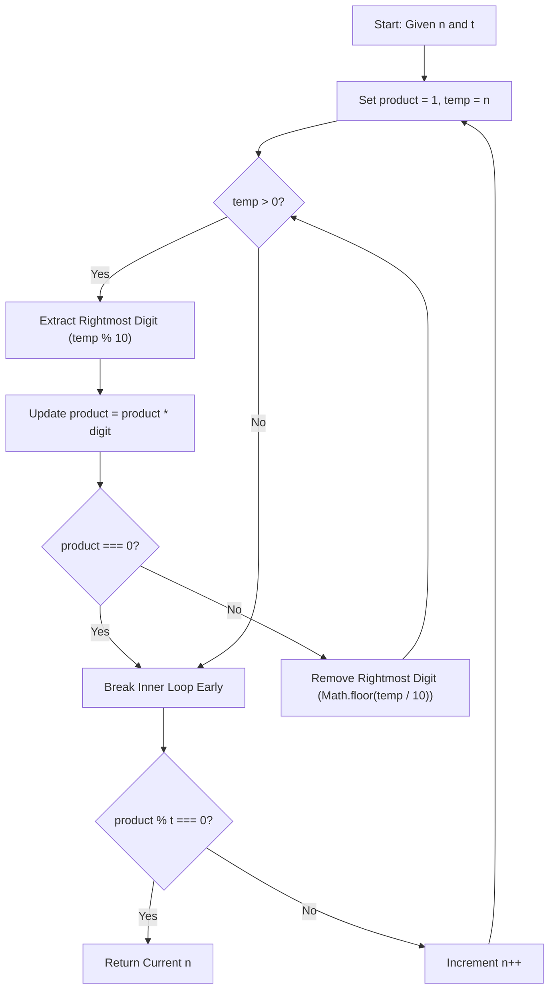

<h2><a href="https://leetcode.com/problems/smallest-divisible-digit-product-i">3345. Smallest Divisible Digit Product I</a></h2>

<p>You are given two integers <code>n</code> and <code>t</code>. Return the <strong>smallest</strong> number greater than or equal to <code>n</code> such that the <strong>product of its digits</strong> is divisible by <code>t</code>.</p>

<p>&nbsp;</p>
<p><strong class="example">Example 1:</strong></p>

<div class="example-block">
<p><strong>Input:</strong> <span class="example-io">n = 10, t = 2</span></p>

<p><strong>Output:</strong> <span class="example-io">10</span></p>

<p><strong>Explanation:</strong></p>

<p>The digit product of 10 is 0, which is divisible by 2, making it the smallest number greater than or equal to 10 that satisfies the condition.</p>
</div>

<p><strong class="example">Example 2:</strong></p>

<div class="example-block">
<p><strong>Input:</strong> <span class="example-io">n = 15, t = 3</span></p>

<p><strong>Output:</strong> <span class="example-io">16</span></p>

<p><strong>Explanation:</strong></p>

<p>The digit product of 16 is 6, which is divisible by 3, making it the smallest number greater than or equal to 15 that satisfies the condition.</p>
</div>

<p>&nbsp;</p>
<p><strong>Constraints:</strong></p>

<ul>
	<li><code>1 &lt;= n &lt;= 100</code></li>
	<li><code>1 &lt;= t &lt;= 10</code></li>
</ul>


---

# 🛍️ Smallest-Divisible-Digit-Product-I | Explained

## Approach 1: Incremental Search with Mathematical Digit Extraction & Early Exit

### Intuition
The problem asks us to find the smallest integer greater than or equal to $n$ whose digit product is divisible by $t$. 

Imagine walking down a street of numbered houses starting at house $n$. At each house, you read the digits on the door, multiply them together, and test if the resulting product can be evenly divided by $t$. Because numbers ending in `0` occur at least once in every sequence of 10 consecutive integers, their digit product will be `0`. Since $0 \pmod t = 0$ for any positive integer $t$, we are guaranteed to find a valid number within at most 10 steps. Thus, an incremental search strategy (checking $n, n+1, n+2, \dots$) is extremely fast and optimal.

### Algorithm Visualized



### Approach
1. **Outer Loop**: Run an infinite `while (true)` loop starting at $n$ to test each candidate integer incrementally.
2. **State Initialization**: For each candidate $n$, initialize a accumulator variable `product = 1` and a working copy `temp = n`.
3. **Digit Extraction Loop**: Extract digits from right to left using modulo arithmetic (`temp % 10`):
   - Multiply the extracted digit into `product`.
   - **Optimization (Early Exit)**: If `product` becomes `0` (which happens if any digit is `0`), immediately break out of digit extraction. Multiplying further digits by `0` is redundant.
   - Truncate the least significant digit using `Math.floor(temp / 10)`.
4. **Divisibility Check**: Evaluate whether `product % t === 0`.
   - If true, the current $n$ satisfies the condition, so return $n$.
   - If false, increment $n$ by $1$ and repeat the process.

### Detailed Code Analysis

```javascript
/**
 * @param {number} n
 * @param {number} t
 * @return {number}
 */
var smallestNumber = function(n, t) {
    while (true) {
        let product = 1;
        let temp = n;
        
        // Extract digits mathematically
        while (temp > 0) {
            product *= temp % 10;
            
            // Early exit: if product becomes 0, it is divisible by any 't'
            if (product === 0) break; 
            
            temp = Math.floor(temp / 10);
        }
        
        // Check if the condition is met
        if (product % t === 0) {
            return n;
        }
        
        n++; // Move to the next number
    }
};
```

- **Line 7**: `while (true)` initiates an unbounded search. We rely on the mathematical guarantee that a solution exists within 10 iterations.
- **Lines 8–9**: `let product = 1; let temp = n;` initializes our digit product accumulator and preserves the value of `n` by performing destructive digit extractions on `temp`.
- **Lines 12–19**: The inner `while (temp > 0)` loop processes the integer mathematically rather than converting it to a string, avoiding unnecessary memory allocations.
- **Line 13**: `product *= temp % 10;` uses the modulo operator `% 10` to get the least significant digit and updates `product`.
- **Line 16**: `if (product === 0) break;` provides short-circuiting. If a zero digit is encountered, the product permanently becomes `0`.
- **Line 18**: `temp = Math.floor(temp / 10);` shifts the number right by one decimal place, discarding the processed digit.
- **Lines 22–24**: `if (product % t === 0) return n;` checks if the calculated product is a multiple of $t$. If so, $n$ is returned immediately.
- **Line 26**: `n++;` increments $n$ to evaluate the next integer in the sequence if the current one fails the condition.

### Code
```javascript
var smallestNumber = function(n, t) {
    while (true) {
        let product = 1;
        let temp = n;
        
        while (temp > 0) {
            product *= temp % 10;
            
            if (product === 0) break; 
            
            temp = Math.floor(temp / 10);
        }
        
        if (product % t === 0) {
            return n;
        }
        
        n++;
    }
};
```

### Complexity
- **Time Complexity:** $\mathcal{O}(1)$ amortized (or $\mathcal{O}(K \cdot \log_{10} n)$ where $K \le 10$).
  - In any block of 10 consecutive integers, at least one number ends in `0` (e.g., 10, 20, 30). The product of digits for a number containing `0` is $0$, and $0 \pmod t = 0$ for all valid $t$. 
  - Therefore, the outer `while` loop runs at most $10$ times ($K \le 10$).
  - The inner `while` loop runs $\lfloor \log_{10} n \rfloor + 1$ times (the number of digits in $n$).
  - For standard constraints where $n$ is small, this operates in virtually instantaneous constant time.

- **Space Complexity:** $\mathcal{O}(1)$ auxiliary space.
  - The algorithm uses a fixed set of scalar variables (`product`, `temp`, `n`) and performs integer arithmetic in-place without dynamic allocations or extra data structures.

---

## 🕵️‍♂️ Follow-up Questions

### 1. What if $n$ could be as large as $10^9$? How does the performance scale?
**Answer:** The time complexity scales logarithmically relative to $n$ because the number of outer loop iterations remains bounded by $10$. Even for $n = 10^9$, the inner loop will execute at most 10 times (since $10^9$ has 10 digits), taking at most ~100 operations in total. Thus, the linear search approach remains extremely efficient even for large inputs.

### 2. Why favor mathematical digit extraction over string conversion (e.g., `String(n).split('')`)?
**Answer:** Mathematical extraction (`temp % 10` and `Math.floor(temp / 10)`) avoids allocating intermediate string primitives, character arrays, and iterator objects on the heap. Heap allocations trigger garbage collection overhead, making string parsing noticeably slower and memory-heavy compared to CPU-native integer arithmetic.