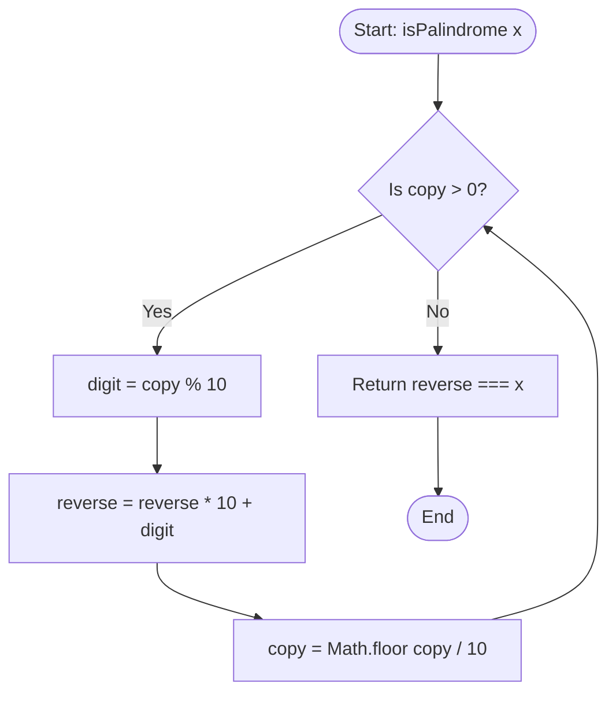

<h2><a href="https://leetcode.com/problems/palindrome-number">9. Palindrome Number</a></h2>

<p>Given an integer <code>x</code>, return <code>true</code> if <code>x</code> is a <span data-keyword="palindrome-integer" class=" cursor-pointer relative text-dark-blue-s text-sm"><button type="button" aria-haspopup="dialog" aria-expanded="false" aria-controls="radix-_r_6u_" data-state="closed" class=""><strong>palindrome</strong></button></span>, and <code>false</code> otherwise.</p>

<p>&nbsp;</p>
<p><strong class="example">Example 1:</strong></p>

<pre><strong>Input:</strong> x = 121
<strong>Output:</strong> true
<strong>Explanation:</strong> 121 reads as 121 from left to right and from right to left.
</pre>

<p><strong class="example">Example 2:</strong></p>

<pre><strong>Input:</strong> x = -121
<strong>Output:</strong> false
<strong>Explanation:</strong> From left to right, it reads -121. From right to left, it becomes 121-. Therefore it is not a palindrome.
</pre>

<p><strong class="example">Example 3:</strong></p>

<pre><strong>Input:</strong> x = 10
<strong>Output:</strong> false
<strong>Explanation:</strong> Reads 01 from right to left. Therefore it is not a palindrome.
</pre>

<p>&nbsp;</p>
<p><strong>Constraints:</strong></p>

<ul>
	<li><code>-2<sup>31</sup>&nbsp;&lt;= x &lt;= 2<sup>31</sup>&nbsp;- 1</code></li>
</ul>

<p>&nbsp;</p>
<strong>Follow up:</strong> Could you solve it without converting the integer to a string?

---

# 🛍️ Palindrome-Number | Explained

## Approach 1: Mathematical Integer Reversal

### Intuition
To determine if a number reads the same forwards and backwards without converting it to a string, we can re-create the integer in reverse order mathematically. 

Imagine you have a stack of numbered blocks aligned in a row (e.g., `1`, `2`, `1`). You want to build a second tower next to it. You repeatedly pull the rightmost block off your original number using modulo arithmetic (`% 10`), append it to your new number by shifting existing digits left (`reverse * 10 + digit`), and shrink the original number (`Math.floor(copy / 10)`). Once all blocks are moved, if the new number equals the original, it is a palindrome.

Negative numbers (e.g., `-121`) can never be palindromes because the negative sign remains at the front (e.g., `121-`), which is handled naturally because the initial condition `copy > 0` evaluates to false immediately for any negative integer.

### Algorithm Visualized



### Approach
1. **Initialize State**: Maintain a variable `reverse` initialized to `0` to accumulate the reversed number, and a `copy` of `x` so we do not mutate the input argument.
2. **Process Digits**: Loop while `copy > 0`:
   - Extract the last digit of `copy` using the remainder operator (`copy % 10`).
   - Append this digit to `reverse` by shifting `reverse` one decimal place to the left (`reverse * 10`) and adding `digit`.
   - Remove the last digit from `copy` using integer division (`Math.floor(copy / 10)`).
3. **Compare**: After exiting the loop, compare `reverse` with the original input `x`. If they are equal, return `true`; otherwise, return `false`.

### Detailed Code Analysis

Let's break down the mechanics line-by-line:

- **`let reverse = 0;`**: Initializes our accumulator variable. This will hold the reversed integer as we extract digits.
- **`let copy = x;`**: Creates a working duplicate of the input integer `x`. Since we need to compare our result to `x` at the end, we cannot mutate `x` directly.
- **`while(copy > 0)`**: 
  - If `x` is negative (e.g., `-121`), `copy > 0` evaluates to `false` immediately. The loop skips, and `reverse` (0) is compared against `x` (`-121`), correctly returning `false`.
  - If `x` is `0`, the loop skips and returns `0 === 0` (`true`).
- **`const digit = copy % 10;`**: Extracts the rightmost digit. For example, if `copy = 123`, `123 % 10` evaluates to `3`.
- **`reverse = (reverse * 10) + digit;`**: Shifts the current accumulated reversed value left by one decimal place (multiplying by 10) and adds the extracted digit.
- **`copy = Math.floor(copy / 10);`**: Performs integer division by 10 to drop the rightmost digit from `copy`.
- **`return reverse === x;`**: Performs a strict equality check between the reconstructed `reverse` number and the original input `x`.

### Code

```javascript
/**
 * @param {number} x
 * @return {boolean}
 */
var isPalindrome = function(x) {
    let reverse = 0;
    let copy = x;
    
    while (copy > 0) {
        const digit = copy % 10;
        reverse = (reverse * 10) + digit;
        copy = Math.floor(copy / 10);
    }
    
    return reverse === x;
};
```

### Complexity
- **Time Complexity:** $\mathcal{O}(\log_{10}(x))$. In each iteration of the `while` loop, we divide `copy` by $10$. The total number of iterations is proportional to the number of decimal digits in $x$, which is $\lfloor\log_{10}(x)\rfloor + 1$.
- **Space Complexity:** $\mathcal{O}(1)$. Memory usage is constant because we only allocate a few primitive scalar variables (`reverse`, `copy`, `digit`) regardless of the size of $x$.

---

## 🕵️‍♂️ Follow-up Questions

### 1. How would you prevent potential integer overflow in languages like C++ or Java without using a 64-bit integer (`long`)?
**Answer:** Instead of reversing the *entire* integer, you can reverse only the *latter half* of the number and compare it to the first half. 
- You stop the `while` loop when `x <= reverse` (where `x` is being truncated and `reverse` is being built).
- For even-length numbers, you check if `x === reverse`.
- For odd-length numbers, you check if `x === Math.floor(reverse / 10)` (to ignore the middle digit).
- Edge cases like numbers ending in `0` (except `0` itself) must be handled upfront (e.g., `if (x < 0 || (x % 10 === 0 && x !== 0)) return false;`).

### 2. Why is converting the number to a String generally considered sub-optimal in technical interviews?
**Answer:** Converting to a string (`x.toString().split('').reverse().join('')`) incurs:
- $\mathcal{O}(N)$ dynamic memory allocation for heap space to store the string character arrays.
- Garbage collection overhead.
- It bypasses the underlying mathematical/bitwise logic principles the interviewer is attempting to test.